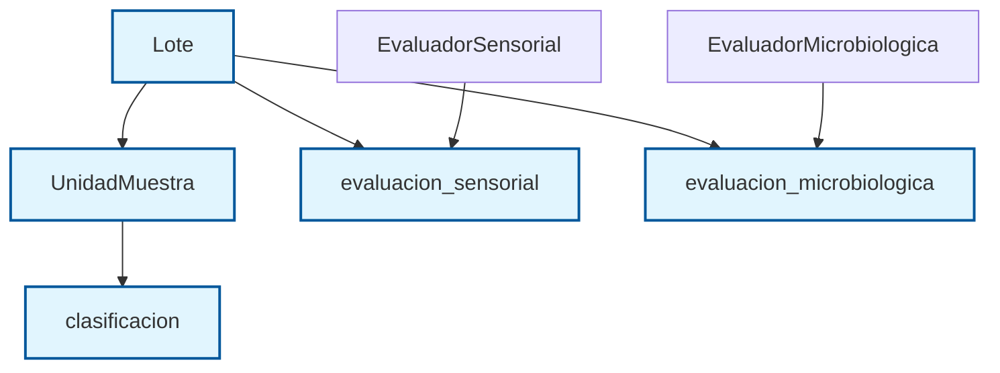

# Sistema de Evaluación de Calidad de Carne de Tilapia

Aplicación de escritorio desarrollada en Java con JavaFX para la gestión de lotes y evaluación de la calidad de carne de tilapia.

## Características

- **Gestión de Lotes**: Registro, consulta y seguimiento de lotes de carne de tilapia.
- **Evaluación de Calidad**:
  -Proximamente se podrá escalar a implementar la CNN
- **Estados de Lote**:
  - **Abierto**: Lote registrado y listo para evaluación.
  - **En Evaluación**: Evaluación de unidades en progreso.
  - **Evaluado**: Cuando llega al tope definido de muestras.
  - **Reportado**: Aquí ya sacó la evaluación del lote
- **Generación de Códigos**:
  - Generación automática de códigos únicos para cada lote.
  - Sistema de serialización inteligente para evitar colisiones.

## 🚀 Instalación y Ejecución

### Requisitos Previos

- **Java 21** o superior
- **Maven** 3.6 o superior

### Compilación y Ejecución

1. **Clonar el repositorio** (si aún no se ha hecho)

2. **Ejecutar la aplicación** desde la línea de comandos:

```bash
mvn javafx:run
```

## 📁 Estructura del Proyecto

```
secct/
├── pom.xml                # Configuración del proyecto Maven
├── src/
│   ├── main/
│   │   ├── java/co/unillanos/secct/
│   │   │   ├── controlers/         # Controladores de las vistas
│   │   │   ├── entities/           # Entidades del dominio (Lote, UnidadMuestra, etc.)
│   │   │   ├── services/           # Servicios de negocio
│   │   │   ├── usecases/           # Casos de uso
│   │   │   ├── utils/              # Utilidades del sistema
│   │   │   └── Main.java           # Punto de entrada de la aplicación
│   │   └── resources/
│   │       ├── co/unillanos/secct/vistas/
│   │       │   ├── PantallaEvaluadorCalidad.fxml
│   │       │   ├── PantallaGestionLotes.fxml
│   │       │   ├── PantallaReportes.fxml
│   │       │   └── menu_principal.fxml
│   │       └── META-INF/persistence.xml
│   └── test/               # Pruebas unitarias
│
└── target/                 # Archivos compilados y empaquetados
```

## 📊 Diagrama de Clases (Resumen)



## 🛠️ Configuración de Base de Datos

La aplicación utiliza una base de datos MySQL. La configuración se encuentra en `src/main/resources/META-INF/persistence.xml`.

**Configuración actual**:
- **URL**: `jdbc:mysql://localhost:3306/sistema_evaluacion_tilapia`
- **Usuario**: `root`
- **Contraseña**: (vacío)

**Nota**: Asegúrate de tener una base de datos con el nombre `sistema_evaluacion_tilapia` creada antes de ejecutar la aplicación.

## 🚀 Despliegue

### Modo Desarrollo (Recomendado)

```bash
mvn javafx:run
```
# 📝 Notas de Desarrollo

- La aplicación sigue una arquitectura limpia con separación de responsabilidades
- Se han implementado casos de uso para cada funcionalidad principal
- Control de errores robusto con validaciones en cada capa
- Generación inteligente de códigos de lote para evitar colisiones
- Interfaz de usuario intuitiva con JFXPanel para integración Swing/JavaFX